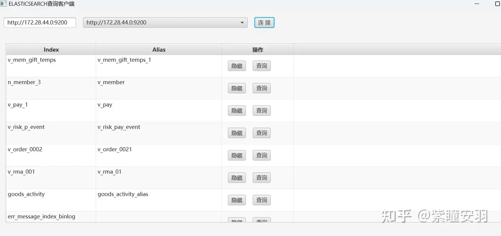
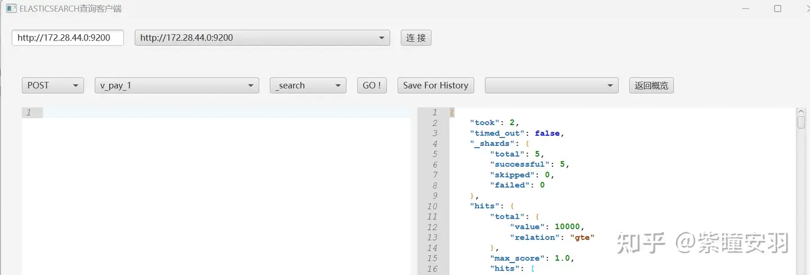
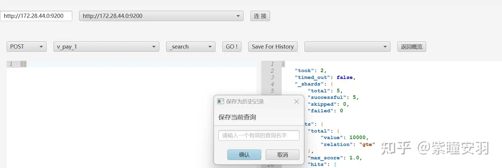
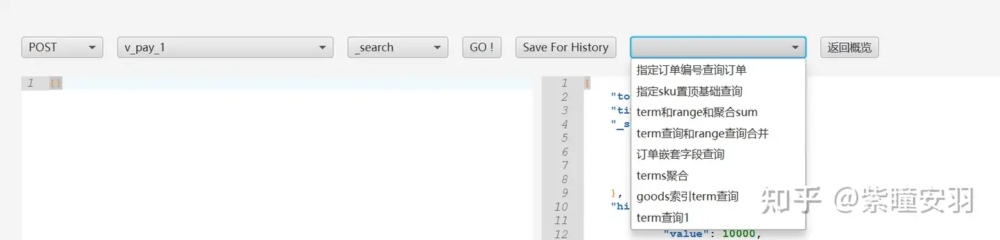

## javafx project for elasticsearch desktop tool for query/search/analyse

## all you need
* jdk21
* eclipse or idea

### features
*   http format es url,such as :http://localhost:9300
*   basic auth (username and password),which your es url required
*   build your own query history
* 
### page function 

